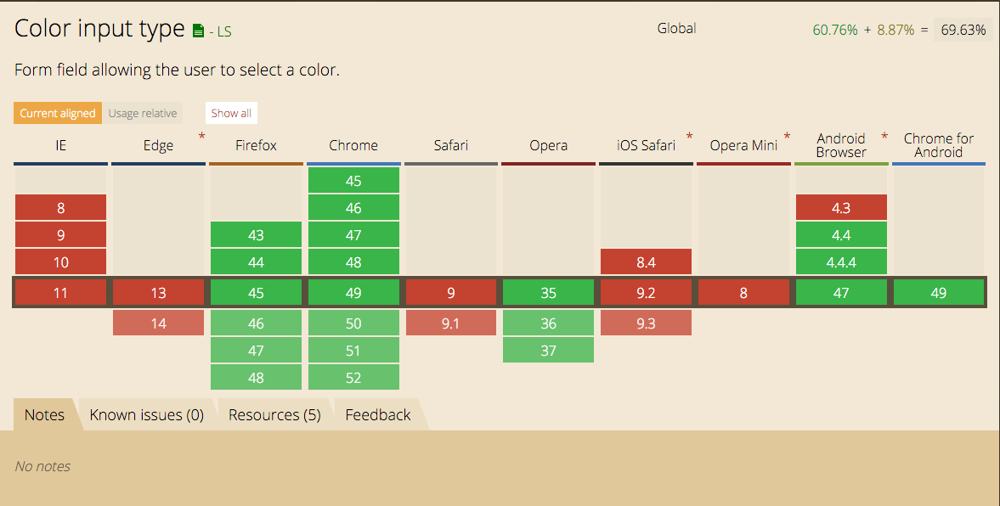
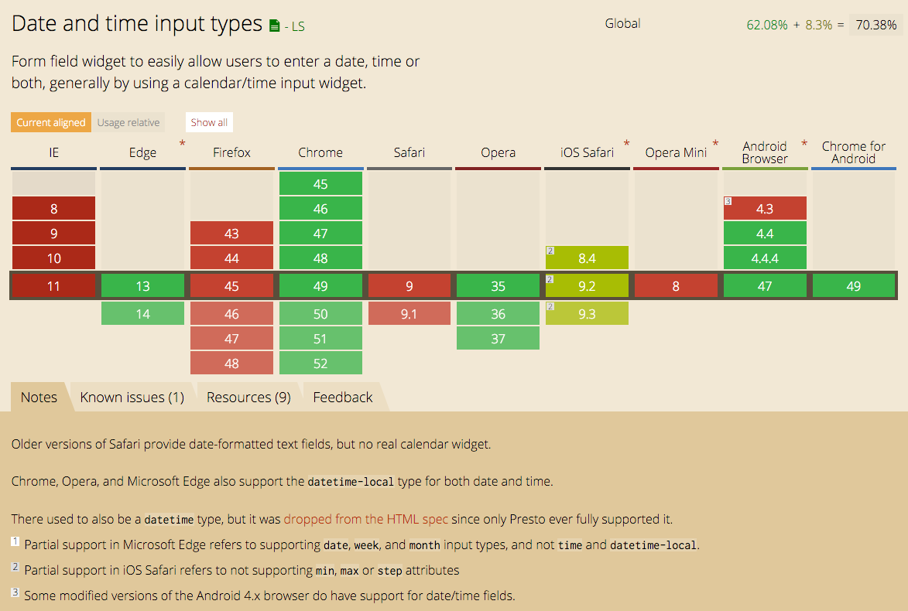

#Exercise 2.1 - 1,2,3 Feature detection

##Chosen Features

## HTML5
Both polyfills require jQuery

#### ```<input type="color">```

Browser support:
 

Tested on: Safari 9.0.3

Fallback:   
The date input is a ```<input type="text">``` with a placeholder to give the user feedback about the desired format, the server will check the input and if needed convert it to the desired format.

Or you can use a Polyfill called [Spectrum](https://github.com/bgrins/spectrum)

This polyfill works without any editing. Just add the cdn's in the head
```
<script src="docs/jquery-1.9.1.js"></script>
<script src="https://cdnjs.cloudflare.com/ajax/libs/spectrum/1.8.0/spectrum.min.js"></script>
<link rel="stylesheet" type="text/css" href="https://cdnjs.cloudflare.com/ajax/libs/spectrum/1.8.0/spectrum.min.css">
```


=================================

#### ```<input type="date">```

Browser support:
 

Tested on: Safari 9.0.3 & Firefox 44.0.2

Fallback:  
The color input is a ```<select></select>``` with a few standard colors. The server will convert the value string into a hex color code.

Or you can use a Polyfill called [webshim](https://github.com/aFarkas/webshim)  

This polyfill works really simpel:

1 Include JS
```
<script src="js/jquery.js"></script>

<script src="js-webshim/minified/polyfiller.js"></script> 

<script> 
    // load and implement all unsupported features 
    webshims.polyfill();

    // or only load a specific feature
    //webshims.polyfill('forms es5');
</script>
```
2 Wait till everything has been loaded and then use it:
```
<script> 
    $(function(){
        // work with the HTML5 API
        $('input:invalid').each(function(){
            $(this).after( $.prop(this, 'validationMessage') );
        });
        // ...
    });
</script>
```
This polyfill covers multiple features:
* canvas
* HTML5 form features including: constraint validation and form widgets (input[type="range"], input[type="date"], input[type="number"], input[type="time"], input[type="month"], output, progress, input[list]/datalist)
* HTML5 audio/video/track implementation
* matchMedia
* interactive elements: summary/details
* XHR2 / filereader (including, XHR2/AJAX CORS and FormData handling)
* picture / img[srcset]
* promise
* geolocation
* ECMAScript 5 / JavaScript 1.8.5 features
* window.URL
* getUserMedia ('usermedia' currently only access to user's camera, not microphone)
* sticky (position: sticky)

======================

##CSS3

